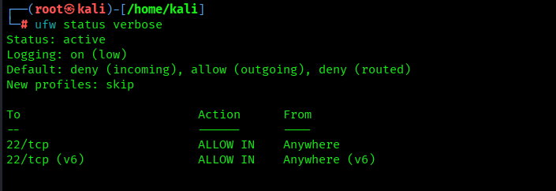
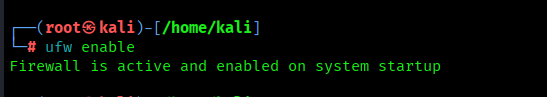
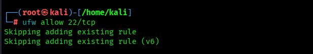
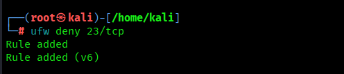
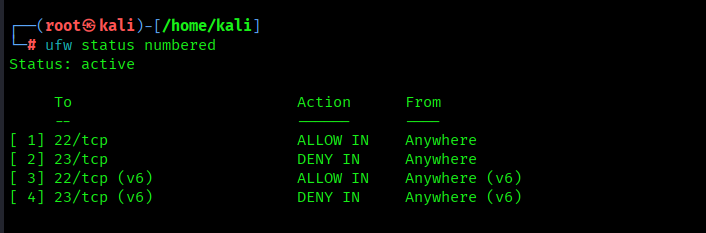
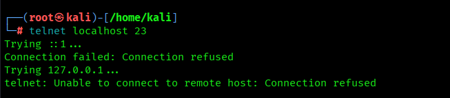
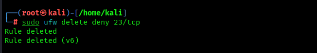
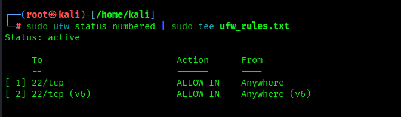

# 🔥 Setup and Use a Firewall on Linux (UFW)
**Author:** Srushti Dave                                                  
**Internship:** Cyber Security Internship                         
**Repository:** firewall-setup
**Objective:** Configure and test basic firewall rules to allow or block specific network traffic using **UFW (Uncomplicated Firewall)**.

---

## 🧱 Overview
A firewall is a network security system that monitors and controls incoming and outgoing traffic based on predetermined security rules.  
This task demonstrates how to use **UFW** on Linux to:
- Block insecure services (**Telnet – port 23**)
- Allow secure services (**SSH – port 22**)
- Test rule enforcement
- Restore firewall state after testing

---

## ⚙️ Tools & Environment
| Component | Details |
|------------|----------|
| **Operating System** | Kali Linux 2024 |
| **Firewall Tool** | UFW (Uncomplicated Firewall) |
| **Shell** | Zsh / Bash |
| **Verification Tools** | Telnet, Netcat (nc) |

---

## 🧩 Step-by-Step Implementation

### **1️⃣ Check Firewall Status**
```bash
sudo ufw status verbose
```
### **2️⃣ Enable Firewall**
```bash
sudo ufw enable
```
### **3️⃣ Allow SSH (Port 22)**
```bash
sudo ufw allow 22/tcp
```
### **4️⃣ Block Telnet (Port 23)**
```bash
sudo ufw deny 23/tcp
```
### **5️⃣ Verify All Rules**
```bash
sudo ufw status numbered
```
##**Example Output:**
```bash
Status: active

     To                         Action      From
     --                         ------      ----
[ 1] 22/tcp                     ALLOW IN    Anywhere
[ 2] 23/tcp                     DENY IN     Anywhere
[ 3] 22/tcp (v6)                ALLOW IN    Anywhere (v6)
[ 4] 23/tcp (v6)                DENY IN     Anywhere (v6)
```
### **6️⃣ Test the Firewall (Telnet Should Fail)**
```bash
telnet localhost 23
# OR
nc -vz localhost 23
```
### **Expected Output:**
```bash
Trying ::1...
Connection failed: Connection refused
Trying 127.0.0.1...
telnet: Unable to connect to remote host: Connection refused
```
### **7️⃣ Delete Test Rule (Restore Original State)**
```bash
sudo ufw delete deny 23/tcp
```
### **Output Example:**
```bash
Rule deleted
Rule deleted (v6)
```
### **8️⃣ Export Final Rules**
```bash
sudo ufw status numbered | sudo tee ufw_rules.txt
```
### **Example Saved Output (ufw_rules.txt):**
```bash
Status: active

     To                         Action      From
     --                         ------      ----
[ 1] 22/tcp                     ALLOW IN    Anywhere
[ 2] 22/tcp (v6)                ALLOW IN    Anywhere (v6)
```
---

## 📸 Screenshots

### 1️⃣ Check Firewall Status


### 2️⃣ Enable Firewall


### 3️⃣ Allow SSH (Port 22)


### 4️⃣ Block Telnet (Port 23)


### 5️⃣ Verify UFW Rules


### 6️⃣ Test Telnet Connection (Expected to Fail)


### 7️⃣ Delete Telnet Rule (Restore State)


### 8️⃣ Export Final Rules


---

## ⚙️ Usage
### 🧩 run_commands.sh
Automates the complete firewall configuration and testing process.
### ▶️ Run the Script
```bash
chmod +x run_commands.sh
./run_commands.sh
```
---

## 📄 ufw_rules.txt
Stores the exported list of currently active UFW rules after configuration.
### 🪶 View the Rules
```bash
cat ufw_rules.txt
```
---
## 👩‍💻 Author
**Srushti Dave**
---
